# IaC Sentinel

**Langue :** [English](README.md) | Français

Revueur automatique de plans Terraform. IaC Sentinel lit la sortie `terraform plan -json`, met en évidence les changements destructeurs, les violations de politiques et (à venir) l’impact coût, afin d’éviter que des modifications d’infrastructure risquées passent inaperçues.

[](https://go.dev/)
[](https://www.terraform.io/)
[](https://www.openpolicyagent.org/)
[](https://aws.amazon.com/)

| Statut | Composant |
|--------|-----------|
| Fait | Parseur de plan (`internal/tfplan`) |
| Fait | Classificateur de risque (`internal/risk`) |
| Fait | Moteur de policies (`internal/policy`, OPA Rego, Checkov/tfsec optionnels) |
| Fait | CLI (`scan` / `version`), rendu terminal, `--fail-on` |
| Prévu | Estimation de coût, score ML, explainer LLM, GitHub Action |

---

## Problème

La CI s’arrête souvent à « terraform plan succeeded ». Personne ne lit un diff de plan de plusieurs centaines de lignes. Un seul `destroy` sur une base de production peut passer. IaC Sentinel vise à le détecter avant le merge.

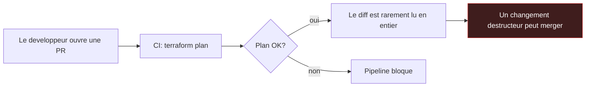

---

## Perimetre (v1)

- AWS uniquement
- Utilisable sans composant IA (`--no-ai` lorsque l’explainer arrivera)
- Scanners externes optionnels (Checkov, tfsec) : avertir s’ils manquent, ne jamais faire echouer uniquement pour un binaire absent
- Go idiomatique : erreurs wrappees, tests table-driven, `gofmt` / `go vet` propres

---

## Structure du projet

### Arborescence

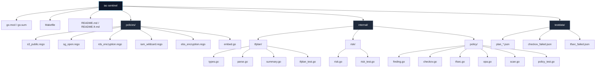

### Roles des packages

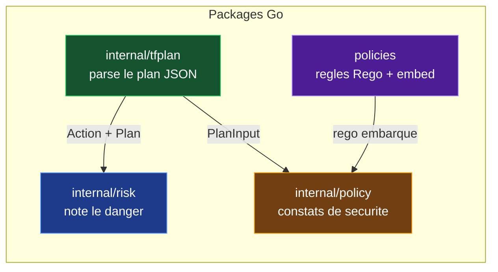

### Graphe de dependances

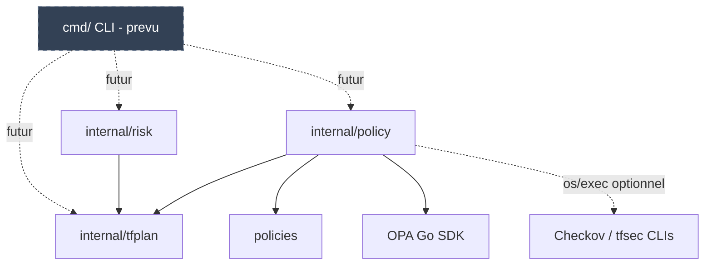

### Layout texte

```text
iac-sentinel/
├── go.mod / go.sum
├── Makefile
├── README.md / README.fr.md
├── policies/                 regles OPA Rego (embarquees dans le binaire)
│   ├── embed.go
│   ├── s3_public.rego
│   ├── sg_open.rego
│   ├── rds_encryption.rego
│   ├── iam_wildcard.rego
│   └── ebs_encryption.rego
├── internal/
│   ├── tfplan/               1. parser le plan JSON
│   │   ├── types.go
│   │   ├── parse.go
│   │   ├── summary.go
│   │   └── tfplan_test.go
│   ├── risk/                 2. SAFE → CRITICAL
│   │   ├── risk.go
│   │   └── risk_test.go
│   └── policy/               3. Finding + scanners
│       ├── finding.go
│       ├── checkov.go
│       ├── tfsec.go
│       ├── opa.go
│       ├── scan.go
│       └── policy_test.go
└── testdata/                 fixtures pour les tests unitaires
    ├── plan_minimal.json
    ├── plan_mixed.json
    ├── plan_replace.json
    ├── plan_not_a_plan.json
    ├── checkov_failed.json
    └── tfsec_failed.json
```

---

## Architecture systeme

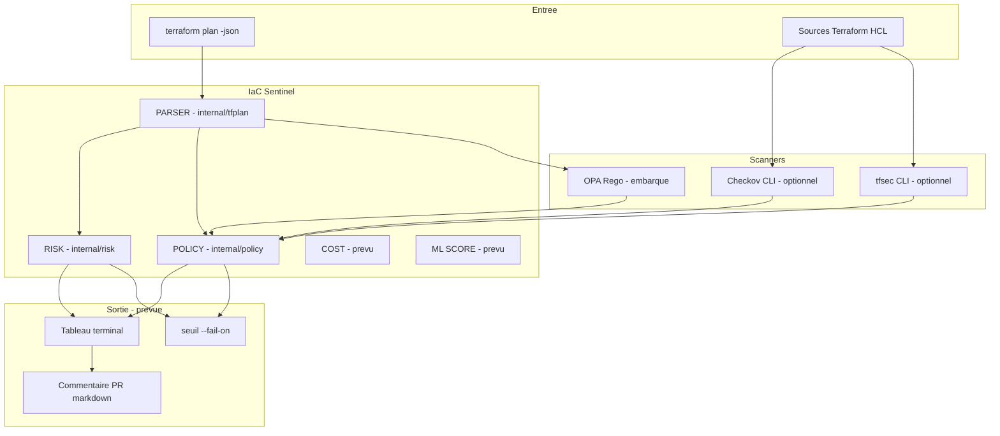

### Sequence de bout en bout

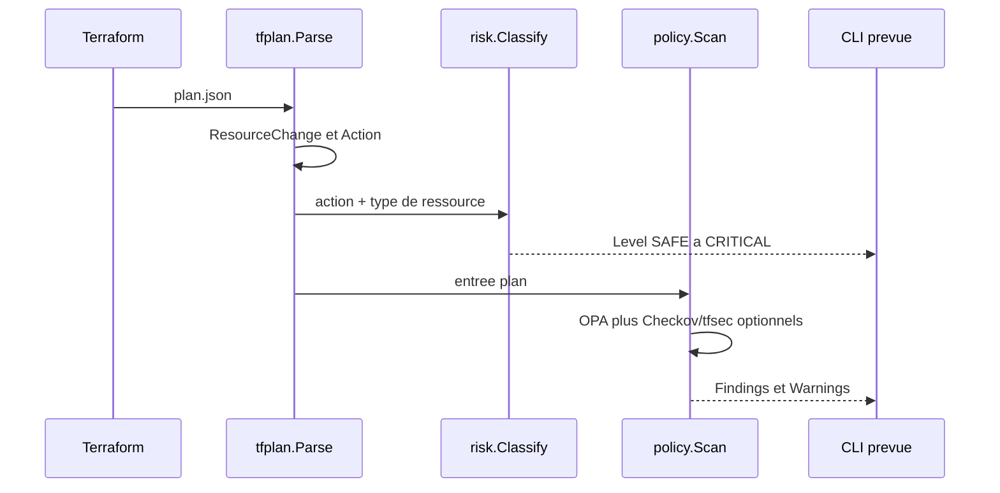

---

## Detail des modules

### `internal/tfplan` — comprendre le plan

| Fichier | Responsabilite |
|---------|----------------|
| `types.go` | `Plan`, `ResourceChange`, `Change`, `Action` ; regroupe un replace encode en `["delete","create"]` |
| `parse.go` | `Parse` / `ParseFile` ; retourne `ErrNotAPlan` si `format_version` manque |
| `summary.go` | Compte create/update/replace/delete ; exclut no-ops et data sources |
| `tfplan_test.go` | Tests unitaires sur fixtures |

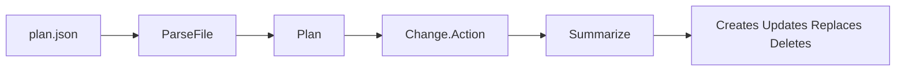

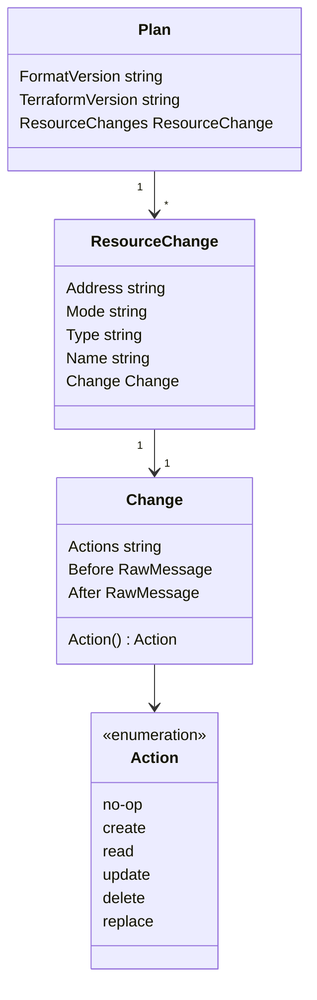

---

### `internal/risk` — quel est le niveau de danger ?

| Fichier | Responsabilite |
|---------|----------------|
| `risk.go` | `Level`, table stateful, `Classify`, `String` |
| `risk_test.go` | Couvre niveaux de base et escalade stateful |

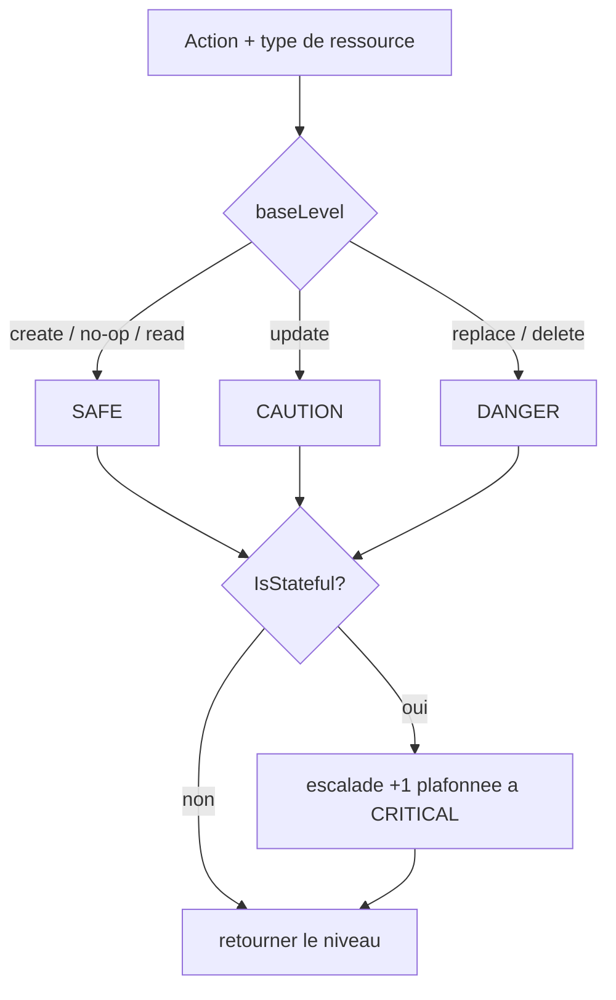

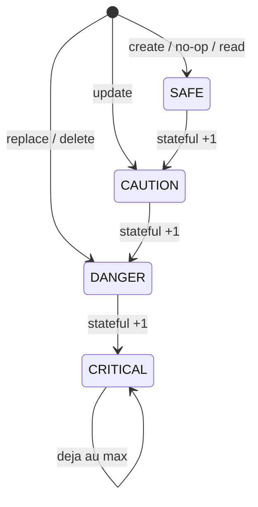

**Mapping de base (non stateful)**

| Action | Niveau |
|--------|--------|
| create / no-op / read / inconnu | `SAFE` |
| update | `CAUTION` |
| replace / delete | `DANGER` |

**Exemples avec escalade :** create S3 → `CAUTION` ; update RDS → `DANGER` ; delete RDS → `CRITICAL`.

---

### `internal/policy` — constats de securite

| Fichier | Responsabilite |
|---------|----------------|
| `finding.go` | `Finding` unifie + `Result` |
| `checkov.go` | Wrapper CLI Checkov (`os/exec` + JSON) |
| `tfsec.go` | Wrapper CLI tfsec |
| `opa.go` | Evaluation SDK OPA + `PlanInput` |
| `scan.go` | Fusion de tous les scanners |
| `policy_test.go` | Fixtures JSON + cas OPA + warning si binaire absent |

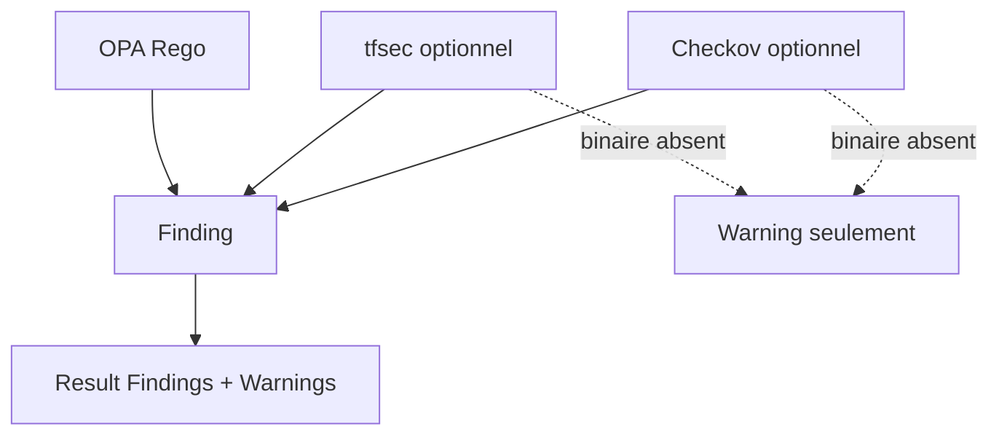

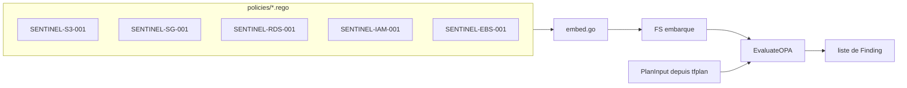

**Policies OPA integrees**

| Fichier | ID | Detecte |
|---------|----|---------|
| `s3_public.rego` | `SENTINEL-S3-001` | ACL S3 public-read / public-read-write |
| `sg_open.rego` | `SENTINEL-SG-001` | Security group ouvert a `0.0.0.0/0` |
| `rds_encryption.rego` | `SENTINEL-RDS-001` | RDS sans `storage_encrypted` |
| `iam_wildcard.rego` | `SENTINEL-IAM-001` | Policy IAM avec `Action: "*"` |
| `ebs_encryption.rego` | `SENTINEL-EBS-001` | Volume EBS non chiffre |

---

## Demarrage rapide

### Prerequis

- Go 1.26+
- Optionnel : [Checkov](https://www.checkov.io/) et/ou [tfsec](https://github.com/aquasecurity/tfsec) sur le `PATH`

### Build et tests

```bash
make test
make vet
make build
./bin/iac-sentinel version
```

### Scanner un plan

```bash
./bin/iac-sentinel scan -plan testdata/plan_mixed.json
./bin/iac-sentinel scan -plan plan.json -dir ./infra
./bin/iac-sentinel scan -plan plan.json -fail-on DANGER
```

| Flag | Signification |
|------|---------------|
| `-plan` | Chemin du JSON `terraform plan -json` (requis) |
| `-dir` | Dossier HCL pour Checkov/tfsec |
| `-fail-on` | `SAFE` / `CAUTION` / `DANGER` / `CRITICAL` — exit 1 si atteint |
| `-skip-checkov` / `-skip-tfsec` / `-skip-opa` | Desactiver un scanner |

### Exemples bibliotheque

```go
level := risk.Classify(tfplan.ActionDelete, "aws_db_instance")
// level == risk.CRITICAL
```

---

## Feuille de route

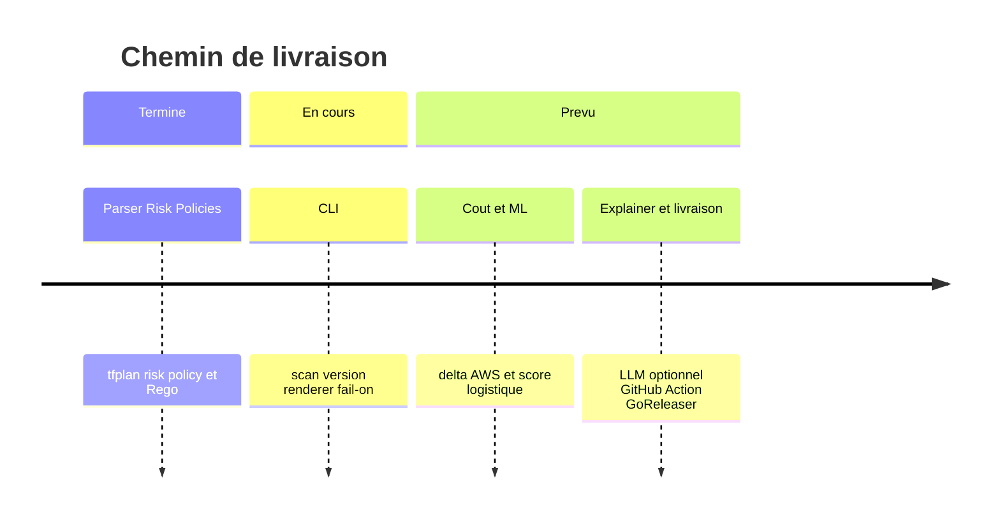

1. Parseur de plan — fait
2. Classification de risque — fait
3. Moteur de policies (OPA + wrappers Checkov/tfsec) — fait
4. Rendu terminal + CLI `scan` / `version` + `--fail-on` — fait
5. Estimation statique du delta de cout AWS
6. Score de risque par regression logistique embarquee
7. Explainer LLM optionnel (`--no-ai`)
8. GitHub Action (commentaire PR) et distribution GoReleaser

---

## Notes de developpement

- Preferer les tests table-driven et les fixtures plutot que Terraform ou scanners live
- Wrapper les erreurs avec `%w` ; utiliser des erreurs sentinelle avec `errors.Is`
- Garder les packages sous `internal/` tant qu’une API publique n’est pas volontaire
- Les scanners optionnels doivent avertir, jamais planter, si le binaire est absent

---

## Licence

Apache 2.0 prevu (fichier de licence a ajouter).
