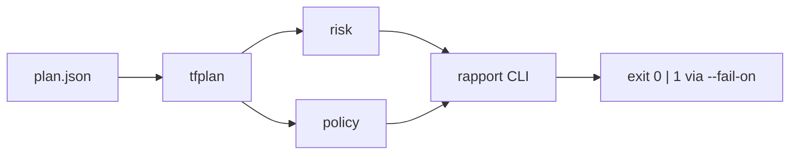

# tfguard

**Langue :** [English](README.md) | Français

Revue automatique de plans Terraform (AWS). tfguard lit `terraform plan -json`, note le risque des changements et évalue des policies de sécurité pour faire échouer la CI avant un apply destructeur.

## Pipeline



| Etape | Package | Role |
|-------|---------|------|
| Parse | `internal/tfplan` | JSON plan → structures Go |
| Risque | `internal/risk` | `SAFE` → `CRITICAL` (+ escalade stateful) |
| Policy | `internal/policy` | OPA embarqué + Checkov/tfsec optionnels |
| CLI | `cmd/tfguard` | `scan`, `version`, `--fail-on` |

## Usage

```bash
make build
./bin/tfguard scan -plan plan.json
./bin/tfguard scan -plan plan.json -dir ./infra -fail-on DANGER
```

## Risque (rappel)

create → `SAFE` · update → `CAUTION` · replace/delete → `DANGER`  
Ressource stateful (RDS, S3, EBS…) → +1 niveau (plafond `CRITICAL`).

## Roadmap

Fait : parse, risk, policies, CLI.  
Suivant : estimation de coût AWS.  
Prévu : score ML, explainer LLM, GitHub Action.

## Licence

Apache 2.0 prévu.
