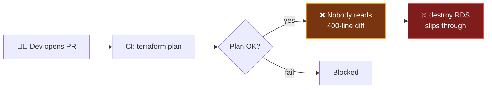
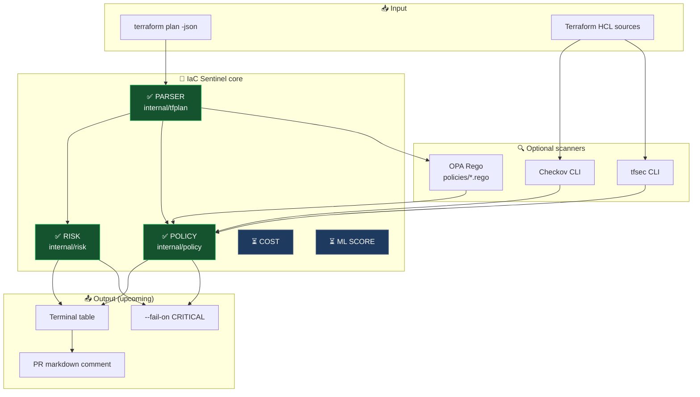
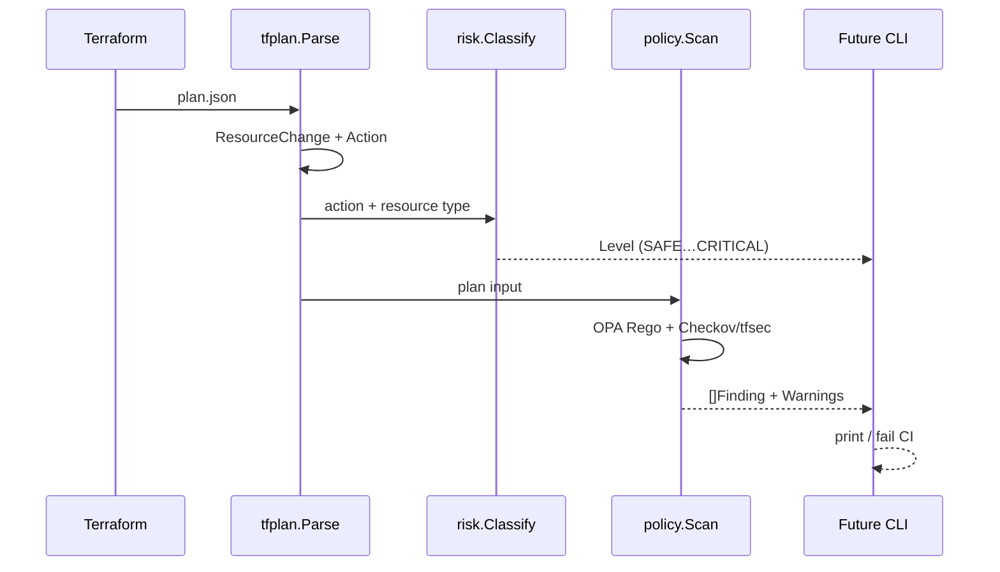
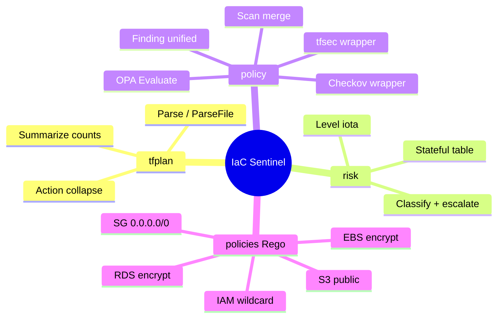
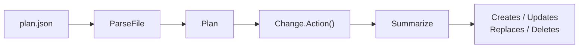
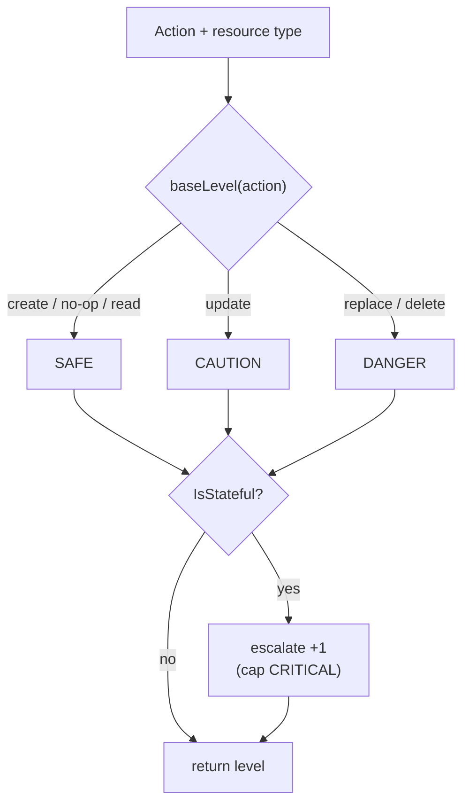
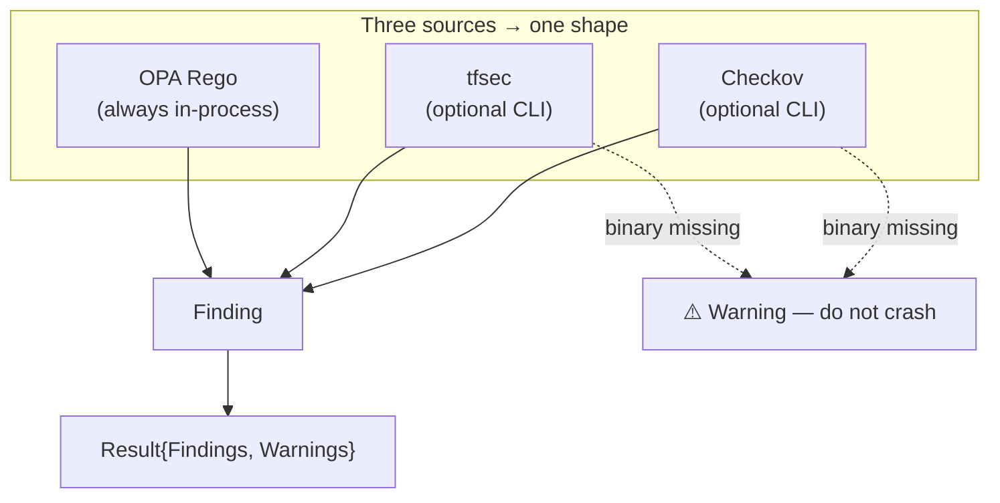
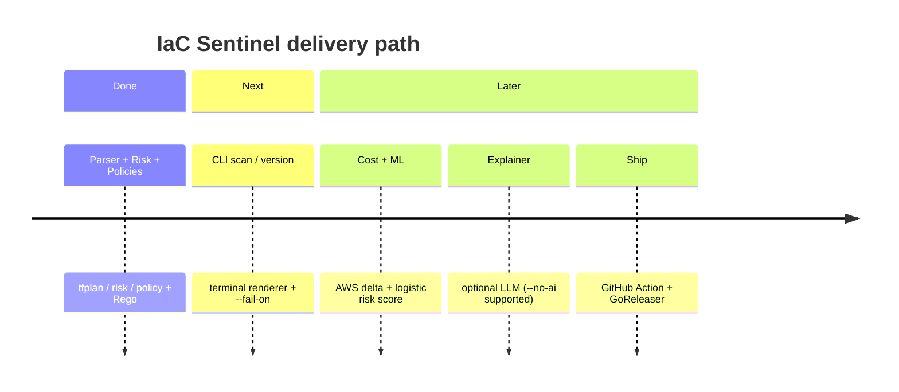

# IaC Sentinel

```text
  ┌─────────────────────────────────────────────────────────────┐
  │                                                             │
  │   ██╗ █████╗  ██████╗    ███████╗███████╗███╗   ██╗         │
  │   ██║██╔══██╗██╔════╝    ██╔════╝██╔════╝████╗  ██║         │
  │   ██║███████║██║         ███████╗█████╗  ██╔██╗ ██║         │
  │   ██║██╔══██║██║         ╚════██║██╔══╝  ██║╚██╗██║         │
  │   ██║██║  ██║╚██████╗    ███████║███████╗██║ ╚████║         │
  │   ╚═╝╚═╝  ╚═╝ ╚═════╝    ╚══════╝╚══════╝╚═╝  ╚═══╝         │
  │                                                             │
  │          Automated reviewer for Terraform plans             │
  └─────────────────────────────────────────────────────────────┘
```

[](https://go.dev/)
[](https://aws.amazon.com/)
[](https://www.openpolicyagent.org/)
[](https://www.terraform.io/)
[-blue?style=for-the-badge)](#license)

> Catch risky Terraform changes **before** they merge — parse the plan, score the risk, enforce security policies.

| Status | Component |
|:------:|-----------|
| ✅ | Plan parser (`internal/tfplan`) |
| ✅ | Risk classifier (`internal/risk`) |
| ✅ | Policy engine (`internal/policy` + OPA + optional Checkov/tfsec) |
| 🚧 | CLI + terminal renderer + `--fail-on` |
| ⏳ | Cost estimation, ML score, LLM explainer, GitHub Action |

---

## Why this exists



**IaC Sentinel** sits after `terraform plan` and answers:

1. **What** changed? (create / update / replace / delete)
2. **How dangerous** is it? (`SAFE` → `CRITICAL`)
3. **Does it break** security policies? (OPA + optional scanners)

---

## High-level architecture



---

## Data flow (what happens to one change)



---

## Repository map

```text
iac-sentinel/
│
├── 📄 go.mod / go.sum          Go module + dependencies (OPA SDK, …)
├── 🛠️  Makefile                 make test | build | fmt | vet
├── 📖 README.md                 you are here
│
├── 📁 policies/                 OPA rules (embedded in the binary)
│   ├── s3_public.rego
│   ├── sg_open.rego
│   ├── rds_encryption.rego
│   ├── iam_wildcard.rego
│   └── ebs_encryption.rego
│
├── 📁 internal/                 private application packages
│   ├── tfplan/                  ① parse plan JSON
│   ├── risk/                    ② score danger
│   └── policy/                  ③ security findings
│
└── 📁 testdata/                 fixtures for unit tests (no live AWS needed)
```



---

## Package deep-dive

### ① `internal/tfplan` — understand the plan

| File | Role |
|------|------|
| `types.go` | `Plan`, `ResourceChange`, `Change`, `Action` |
| `parse.go` | Decode JSON → Go structs (`ErrNotAPlan` if invalid) |
| `summary.go` | Count creates/updates/replaces/deletes (skip no-ops & data sources) |



Terraform sometimes encodes a **replace** as `["delete","create"]`.  
`Change.Action()` collapses that into a single `replace`.

---

### ② `internal/risk` — how dangerous is it?



| Action (non-stateful) | Level |
|-----------------------|-------|
| create / no-op / read | `SAFE` |
| update | `CAUTION` |
| replace / delete | `DANGER` |

**Stateful resources** (RDS, S3, EBS, DynamoDB, …) bump +1:

| Example | Result |
|---------|--------|
| create S3 bucket | `CAUTION` |
| update RDS | `DANGER` |
| **delete RDS** | **`CRITICAL`** |

```text
  SAFE ──► CAUTION ──► DANGER ──► CRITICAL
   0         1           2           3
              ▲ escalate if stateful ▲
```

---

### ③ `internal/policy` — security findings



**Unified `Finding` fields:** `ID`, `Source`, `Severity`, `Title`, `Description`, `Resource`, `File`, `Guideline`.

#### Built-in OPA policies

| Badge | File | ID | Catches |
|:-----:|------|----|---------|
| 🪣 | `s3_public.rego` | `SENTINEL-S3-001` | Public S3 ACL |
| 🔓 | `sg_open.rego` | `SENTINEL-SG-001` | SG open to `0.0.0.0/0` |
| 🗄️ | `rds_encryption.rego` | `SENTINEL-RDS-001` | RDS not encrypted |
| 🔑 | `iam_wildcard.rego` | `SENTINEL-IAM-001` | IAM `Action: "*"` |
| 💾 | `ebs_encryption.rego` | `SENTINEL-EBS-001` | EBS not encrypted |

---

## Quick start

### Prerequisites

- **Go 1.26+**
- Optional on `PATH`: [Checkov](https://www.checkov.io/), [tfsec](https://github.com/aquasecurity/tfsec)

### Commands

```bash
make test          # go test ./... -cover
make vet           # go vet ./...
make fmt           # go fmt ./...
make build         # binary → bin/iac-sentinel
```

> There is **no CLI entrypoint yet**. Exercise the libraries via unit tests and `testdata/` fixtures.

### Snippets

**Risk**

```go
level := risk.Classify(tfplan.ActionDelete, "aws_db_instance")
fmt.Println(level.String()) // CRITICAL
```

**Policies**

```go
result, err := policy.Scan(ctx, plan, policy.ScanOptions{
    TerraformDir: "./infra", // Checkov/tfsec; skipped with a warning if missing
})
for _, f := range result.Findings {
    fmt.Printf("[%s] %s — %s\n", f.Severity, f.ID, f.Title)
}
for _, w := range result.Warnings {
    fmt.Println("warn:", w)
}
```

---

## Roadmap



1. ✅ Plan parser  
2. ✅ Risk classification  
3. ✅ Policy engine (OPA + Checkov/tfsec wrappers)  
4. 🚧 Terminal renderer + `scan` / `version` CLI + `--fail-on`  
5. ⏳ Static AWS cost delta  
6. ⏳ Embedded logistic-regression risk score  
7. ⏳ Optional LLM explainer (`--no-ai`)  
8. ⏳ GitHub Action (PR comment) + GoReleaser  

---

## Development notes

- Prefer **table-driven tests** + fixtures over live Terraform / live scanners  
- Wrap errors with `%w`; use sentinel errors + `errors.Is`  
- Code under `internal/` stays private until a public API is intentional  
- Optional scanners **warn**, never crash, when the binary is absent  

---

## License

Apache 2.0 intended (license file to be added).
