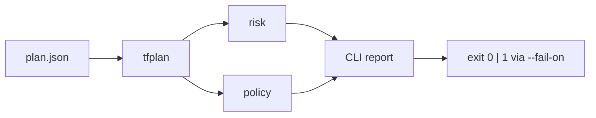

# tfguard

Terraform plan reviewer for AWS. Parses `terraform plan -json`, scores change risk, and evaluates security policies so destructive or non-compliant changes fail in CI—not after apply.

[](https://go.dev/)
[](https://www.terraform.io/)
[](https://www.openpolicyagent.org/)

**Language:** English | [Français](README.fr.md)

---

## Why

A green `terraform plan` is not a review. Long diffs hide deletes on stateful resources (RDS, S3, EBS). tfguard turns the plan into a risk score and policy findings, then exits non-zero when `--fail-on` is reached.

## Pipeline



| Stage | Package | Role |
|-------|---------|------|
| Parse | `internal/tfplan` | Decode plan JSON; collapse actions; summarize mutations |
| Risk | `internal/risk` | `SAFE` → `CRITICAL`; escalate for stateful AWS types |
| Policy | `internal/policy` | OPA Rego (embedded) + optional Checkov/tfsec |
| Orchestrate | `internal/app` | Full report + fail-on evaluation |
| Present | `internal/render` | Terminal output |
| CLI | `cmd/tfguard` | `scan`, `version` |

Optional scanners warn when missing; they never crash the run solely because a binary is absent.

## Risk model

| Action | Base | Stateful (+1) |
|--------|------|----------------|
| create / no-op / read | `SAFE` | `CAUTION` |
| update | `CAUTION` | `DANGER` |
| replace / delete | `DANGER` | `CRITICAL` |

Stateful examples: `aws_db_instance`, `aws_s3_bucket`, `aws_ebs_volume`, `aws_dynamodb_table`.

## Built-in policies

| ID | Rule |
|----|------|
| `TFGUARD-S3-001` | Public S3 ACL |
| `TFGUARD-SG-001` | Security group open to `0.0.0.0/0` |
| `TFGUARD-RDS-001` | RDS without storage encryption |
| `TFGUARD-IAM-001` | IAM `Action: "*"` |
| `TFGUARD-EBS-001` | Unencrypted EBS volume |

## Install & use

```bash
make test
make build
./bin/tfguard version

# Review a plan
./bin/tfguard scan -plan plan.json

# Optional HCL scanners + CI gate
./bin/tfguard scan -plan plan.json -dir ./infra -fail-on DANGER
```

| Flag | Description |
|------|-------------|
| `-plan` | Path to `terraform show -json` / plan JSON (**required**) |
| `-dir` | Terraform root for Checkov/tfsec |
| `-fail-on` | `SAFE` \| `CAUTION` \| `DANGER` \| `CRITICAL` |
| `-skip-checkov` / `-skip-tfsec` / `-skip-opa` | Disable a scanner |

Exit codes: `0` ok · `1` threshold hit or runtime error · `2` usage error.

## Layout

```text
tfguard/
├── cmd/tfguard/          CLI
├── internal/
│   ├── tfplan/           plan parse + summary
│   ├── risk/             risk levels
│   ├── policy/           Checkov / tfsec / OPA
│   ├── app/              orchestration
│   └── render/           terminal report
├── policies/             embedded Rego
└── testdata/             fixtures
```

## Roadmap

1. Done — parse, risk, policies, CLI, `--fail-on`
2. Next — static AWS cost delta
3. Planned — ML risk score, optional LLM explainer (`--no-ai`), GitHub Action, GoReleaser

## Development

```bash
make test && make vet && make fmt
```

- Table-driven tests and fixtures over live Terraform
- Errors wrapped with `%w`; optional tools soft-fail
- Code under `internal/` until a public API is intentional

## License

Apache 2.0 intended.
