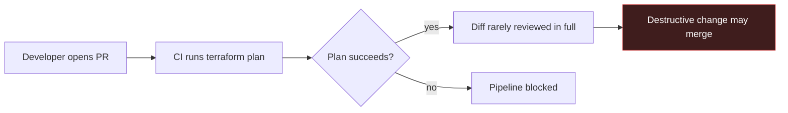
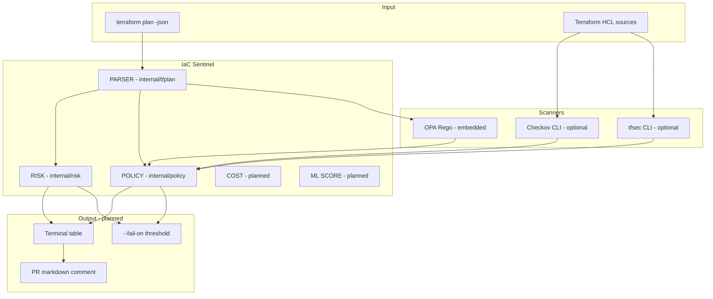
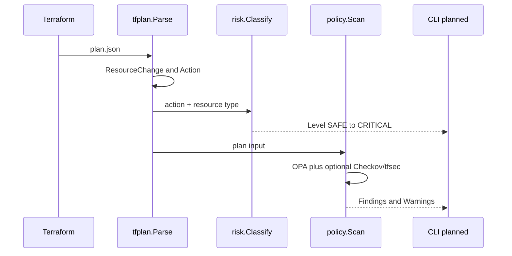
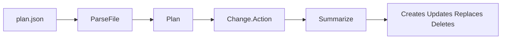
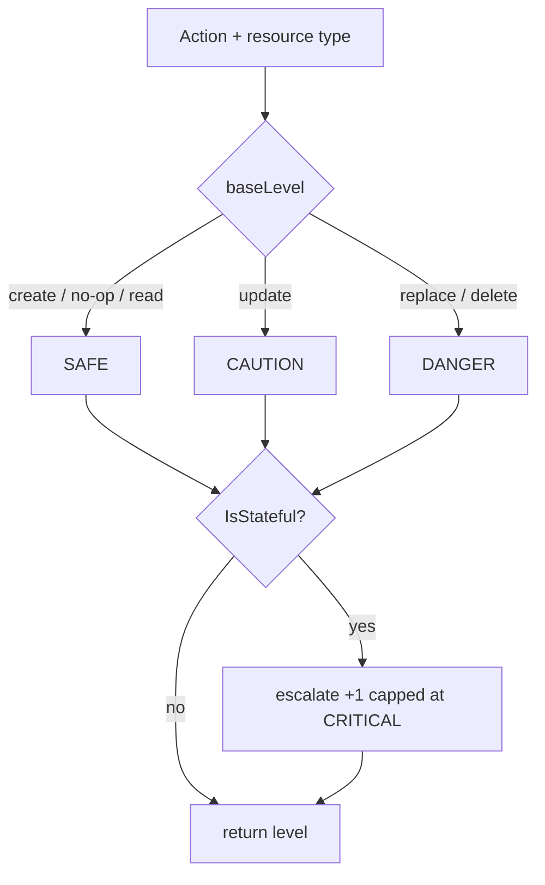
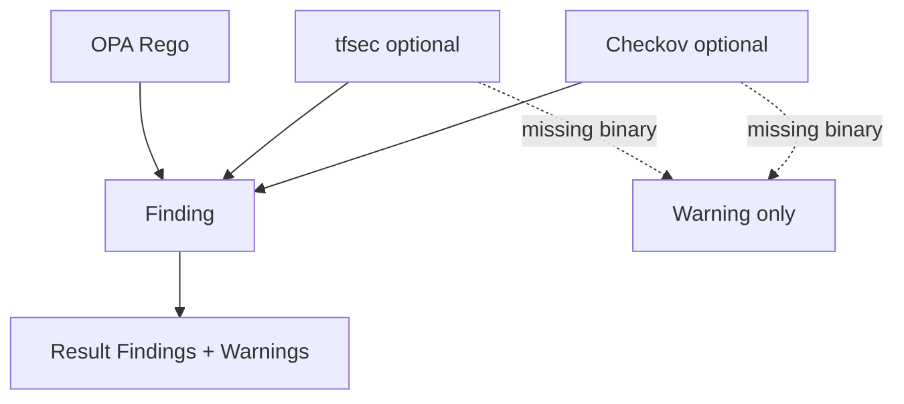
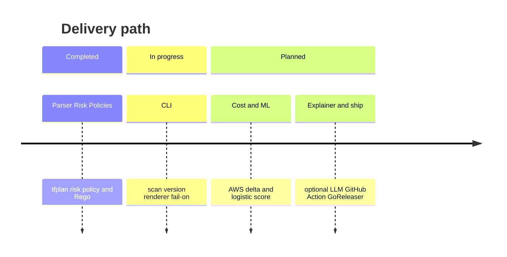

# IaC Sentinel

Automated reviewer for Terraform plans. IaC Sentinel reads `terraform plan -json` output and surfaces destructive changes, policy violations, and (planned) cost impact so teams do not ship risky infrastructure changes unnoticed.

[](https://go.dev/)
[](https://www.terraform.io/)
[](https://www.openpolicyagent.org/)
[](https://aws.amazon.com/)

| Status | Component |
|--------|-----------|
| Done | Plan parser (`internal/tfplan`) |
| Done | Risk classifier (`internal/risk`) |
| Done | Policy engine (`internal/policy`, OPA Rego, optional Checkov/tfsec) |
| Next | CLI, terminal renderer, `--fail-on` |
| Planned | Cost estimation, ML score, LLM explainer, GitHub Action |

---

## Problem

CI often stops at “terraform plan succeeded.” Nobody reads a long plan diff. A single `destroy` on a production database can slip through. IaC Sentinel is meant to catch that before merge.



---

## Scope (v1)

- AWS only
- Usable without any AI component (`--no-ai` when the explainer lands)
- Optional external scanners (Checkov, tfsec): warn if missing, never hard-fail solely because a binary is absent
- Idiomatic Go: wrapped errors, table-driven tests, `gofmt` / `go vet` clean

---

## Architecture



### Request flow



---

## Repository layout

```text
iac-sentinel/
├── go.mod / go.sum
├── Makefile
├── README.md
├── policies/                 # OPA Rego rules (embedded in the binary)
│   ├── s3_public.rego
│   ├── sg_open.rego
│   ├── rds_encryption.rego
│   ├── iam_wildcard.rego
│   └── ebs_encryption.rego
├── internal/
│   ├── tfplan/               # plan JSON parsing and summary
│   ├── risk/                 # SAFE → CRITICAL classification
│   └── policy/               # Finding + Checkov / tfsec / OPA
└── testdata/                 # fixtures for unit tests
```

---

## What works today

### `internal/tfplan`

| Piece | Responsibility |
|-------|----------------|
| `types.go` | `Plan`, `ResourceChange`, `Change`, `Action`; collapses replace encoded as `["delete","create"]` |
| `parse.go` | `Parse` / `ParseFile`; returns `ErrNotAPlan` when `format_version` is missing |
| `summary.go` | Counts create/update/replace/delete; excludes no-ops and data sources |



### `internal/risk`

| Piece | Responsibility |
|-------|----------------|
| `Level` | `SAFE` → `CAUTION` → `DANGER` → `CRITICAL` (`iota`), plus `String()` |
| Stateful table | AWS types that hold durable data (RDS, S3, EBS, DynamoDB, …) |
| `Classify(action, resourceType)` | Base level from action; escalate +1 when stateful (capped at `CRITICAL`) |



**Base mapping (non-stateful)**

| Action | Level |
|--------|-------|
| create / no-op / read / unknown | `SAFE` |
| update | `CAUTION` |
| replace / delete | `DANGER` |

**Examples with escalation:** create S3 → `CAUTION`; update RDS → `DANGER`; delete RDS → `CRITICAL`.

### `internal/policy`

| Piece | Responsibility |
|-------|----------------|
| `Finding` | Unified issue shape shared by every scanner |
| `RunCheckov` / `RunTfsec` | Optional CLI wrappers (`os/exec` + JSON); warn if binary missing |
| `EvaluateOPA` | Embedded Rego policies via the OPA Go SDK |
| `Scan` | Merges Checkov + tfsec + OPA into one `Result` |



**Built-in OPA policies**

| File | ID | Catches |
|------|----|---------|
| `s3_public.rego` | `SENTINEL-S3-001` | S3 ACL public-read / public-read-write |
| `sg_open.rego` | `SENTINEL-SG-001` | Security group open to `0.0.0.0/0` |
| `rds_encryption.rego` | `SENTINEL-RDS-001` | RDS without `storage_encrypted` |
| `iam_wildcard.rego` | `SENTINEL-IAM-001` | IAM policy with `Action: "*"` |
| `ebs_encryption.rego` | `SENTINEL-EBS-001` | EBS volume without encryption |

---

## Getting started

### Prerequisites

- Go 1.26+
- Optional: [Checkov](https://www.checkov.io/) and/or [tfsec](https://github.com/aquasecurity/tfsec) on `PATH`

### Build and test

```bash
make test
make vet
make fmt
make build
```

There is no CLI entrypoint yet. Exercise packages via unit tests and fixtures under `testdata/`.

### Examples

```go
level := risk.Classify(tfplan.ActionDelete, "aws_db_instance")
// level == risk.CRITICAL
```

```go
result, err := policy.Scan(ctx, plan, policy.ScanOptions{
    TerraformDir: "./infra",
})
// result.Findings — unified list
// result.Warnings — e.g. checkov not found; skipping
```

---

## Roadmap



1. Plan parser — done
2. Risk classification — done
3. Policy engine (OPA + Checkov/tfsec wrappers) — done
4. Terminal renderer + `scan` / `version` CLI + `--fail-on`
5. Static AWS cost delta estimation
6. Embedded logistic-regression risk score
7. Optional LLM explainer (`--no-ai`)
8. GitHub Action (PR comment) and GoReleaser distribution

---

## Development notes

- Prefer table-driven tests and fixtures over live Terraform or live scanners
- Wrap errors with `%w`; use sentinel errors with `errors.Is`
- Keep packages under `internal/` until a public API is intentional
- Optional scanners must warn, never crash, when the binary is absent

---

## License

Apache 2.0 intended (license file to be added).
