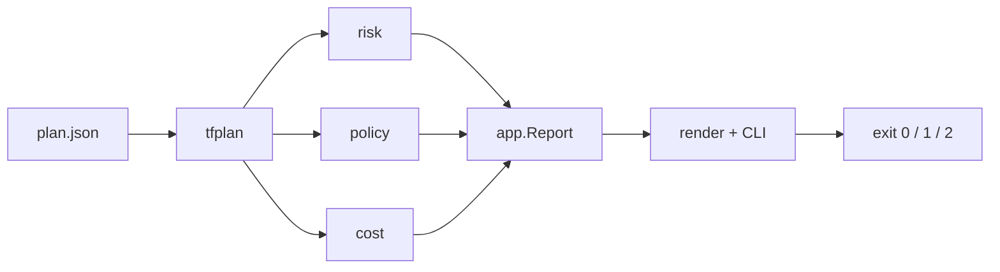

# tfguard

Terraform plan reviewer for AWS. Parses `terraform plan -json`, classifies change risk (`SAFE` → `CRITICAL`), evaluates security policies, and fails CI when `-fail-on` is reached.

[](https://go.dev/)
[](https://www.terraform.io/)
[](https://www.openpolicyagent.org/)

**Language:** English | [Français](README.fr.md)

---

## Problem

A successful `terraform plan` is not a review. Large diffs hide destructive actions—especially on stateful resources (RDS, S3, EBS). tfguard turns the plan into a structured report and an optional non-zero exit for CI gates.

## How it works



| Layer | Package | Responsibility |
|-------|---------|----------------|
| Parse | `internal/tfplan` | Decode plan JSON; collapse actions; summarize mutations |
| Risk | `internal/risk` | Score each change; escalate stateful AWS types |
| Policy | `internal/policy` | OPA Rego (embedded) + optional Checkov/tfsec → `Finding` |
| Cost | `internal/cost` | Static AWS monthly delta from before/after attributes |
| Orchestrate | `internal/app` | Build `Report`; evaluate `-fail-on` / `--max-cost-increase` |
| Present | `internal/render` | Terminal tables |
| CLI | `cmd/tfguard` | Cobra commands: `scan`, `version` |

Optional scanners (Checkov/tfsec) emit **warnings** when missing; they do not crash the run by themselves.

## Risk model

| Action | Base level | If stateful (+1) |
|--------|------------|------------------|
| create / no-op / read | `SAFE` | `CAUTION` |
| update | `CAUTION` | `DANGER` |
| replace / delete | `DANGER` | `CRITICAL` |

Stateful types include RDS, S3, EBS, DynamoDB, EFS, ElastiCache, Redshift, OpenSearch, DocumentDB, Neptune.

## Policies

Embedded Rego under `policies/` (compiled into the binary via `embed`):

| ID | Catches |
|----|---------|
| `TFGUARD-S3-001` | Public S3 ACL |
| `TFGUARD-SG-001` | Security group open to `0.0.0.0/0` |
| `TFGUARD-RDS-001` | RDS without `storage_encrypted` |
| `TFGUARD-IAM-001` | IAM policy with `Action: "*"` |
| `TFGUARD-EBS-001` | Unencrypted EBS volume |

`-fail-on` also maps finding severity onto the same scale: `CRITICAL`→`CRITICAL`, `HIGH`→`DANGER`, `MEDIUM`→`CAUTION`, else `SAFE`.

## CLI

```bash
make test
make build
./bin/tfguard version
./bin/tfguard scan --help

# Basic review
./bin/tfguard scan --plan plan.json

# With HCL scanners + CI gate
./bin/tfguard scan --plan plan.json --dir ./infra --fail-on DANGER

# Fail when monthly cost delta exceeds $50
./bin/tfguard scan --plan plan.json --max-cost-increase 50
```

| Flag | Description |
|------|-------------|
| `--plan` | Path to plan JSON (**required**) |
| `--dir` | Terraform root for Checkov/tfsec |
| `--fail-on` | `SAFE` \| `CAUTION` \| `DANGER` \| `CRITICAL` |
| `--max-cost-increase` | Exit 1 if monthly cost delta USD exceeds this value |
| `--skip-checkov` / `--skip-tfsec` / `--skip-opa` / `--skip-cost` | Disable a stage |

**Exit codes:** `0` ok · `1` threshold hit or runtime error · `2` usage error

Example report (abridged):

```text
tfguard scan report
Plan: testdata/plan_mixed.json
Max risk: CRITICAL

Summary
----------------------------------------
  create : 1
  update : 1
  replace: 1
  delete : 1

Changes
----------------------------------------
RISK      ACTION   TYPE             ADDRESS
CRITICAL  delete   aws_db_instance  aws_db_instance.main
...
```

## Repository layout

```text
cmd/tfguard/       CLI entrypoint
internal/tfplan/   plan parse + summary
internal/risk/     risk levels
internal/policy/   Checkov / tfsec / OPA
internal/cost/     static AWS cost delta
internal/app/      orchestration + fail-on
internal/render/   terminal report
policies/          embedded Rego rules
testdata/          fixtures for unit tests
```

Module path: `github.com/SamyBaouche/tfguard`

## Cost estimate

Static us-east-1 on-demand prices (~20 SKUs: EC2, RDS, ElastiCache, NAT Gateway, …).
Extracts billable attributes from each change’s before/after (`instance_type`, `instance_class`, `allocated_storage`, …), sums a monthly delta, and shows the top 3 drivers.

Use `--max-cost-increase <USD>` as a CI gate on positive deltas. Figures are for plan review, not billing accuracy.

## Roadmap

1. **Done** — parse, risk, policies, CLI, `-fail-on`, static AWS cost delta
2. **Planned** — ML risk score, optional LLM explainer (`--no-ai`), GitHub Action, GoReleaser

## Development

```bash
make test && make vet && make fmt
```

- Prefer table-driven tests and fixtures over live Terraform
- Wrap errors with `%w`; optional tools soft-fail with warnings
- Keep packages under `internal/` until a public API is intentional

## License

Apache 2.0 intended.
